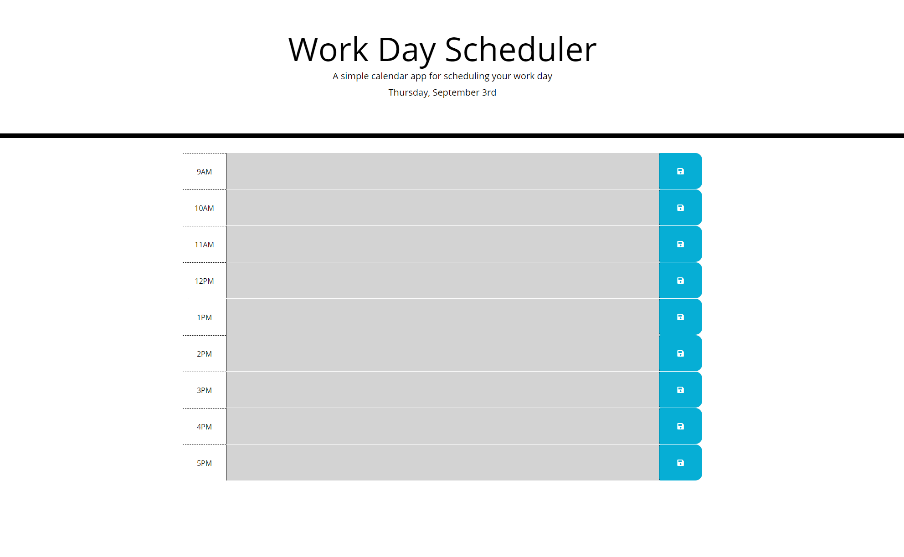
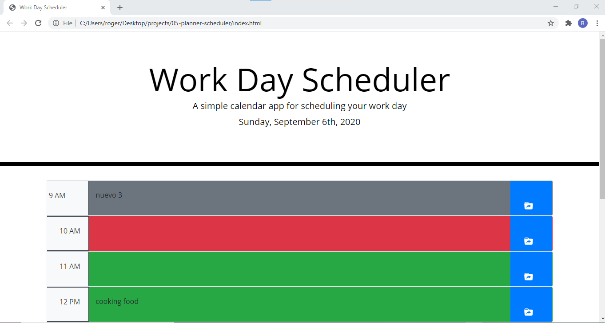
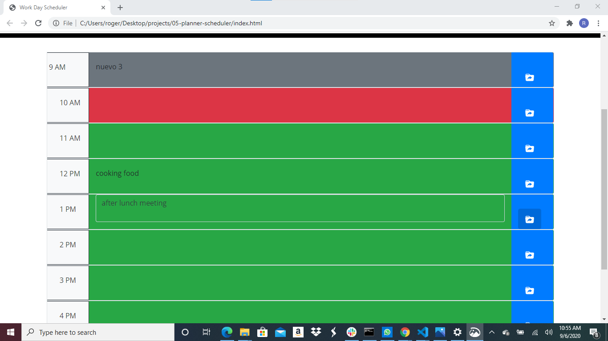
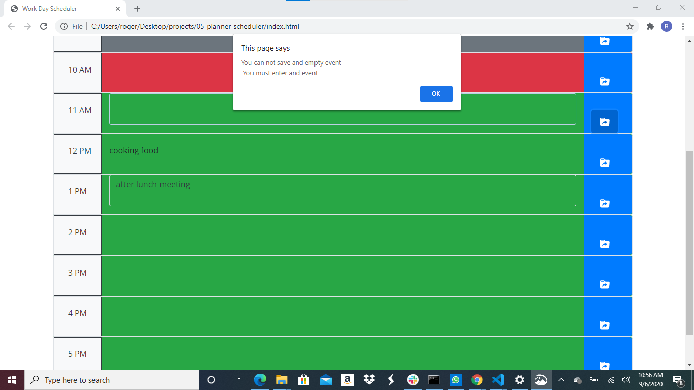

# 05-planner-scheduler
5th Assignment

URLs

Deployed Application: 
    https://rogers0404.github.io/05-planner-scheduler/

GitHub Repository:
    https://github.com/rogers0404/05-planner-scheduler.git 
    
    git@github.com:rogers0404/05-planner-scheduler.git 

Fifth Assignment in UCF Code Boot Camp

1. The Task was divided in several parts to develop the application
    - Fisrt part was divided in 6 parts to match the Acceptance Criteria
        * It was created a function [displayTime()] to deal with the day of the week and the date on top of the site. It was used the Moment.js Libraries
        * It was created a grid with bootstrap to work with the time blocks, 9 rows and 3 columns each row
        * It was created a function [checkingTimeDay()] to show a colored-code for each hour of the day in the schedule planner. Grey if the hours which those are in the past, red is the current hour of the day and green for the hours which are in the future. 
        * It was created a listener with jquery to work with and event click on a time block. For the styling the background of textarea was set with the color of the current colored-code correspondent. 
        * It was created a listener with jquery to work with and event click on a button to save the event typed in localStore. Note, that the information of localstore is saved in a array of objects and every change is saved in the array in localstores even if there are  more than one event for the same time, it will always show the last changing.
        *  It was created a function [loadSchedule()] to bring the information from localstore and show the current events saved in localstore

    - The second part was about the styling using the libraries from bootstraps to give to the application an appearance like the mock-up in the challenge. It was used my-* for margin top and bottom, w-100 and h-100 for spacing inside the column. it was also used an icon for bootstrap [https://icons.getbootstrap.com/icons/folder-symlink-fill/] for the button.

    - The last part was organizing the code in script.js and fixing some errors in DevTools
        * It was created and alert when the user is trying to save an event and the textarea is empty.
        * In the code, Using JQuery it was used the methods children, parent and parents to get access to the correspont child or parent with the purpose to manipulate the DOM with JQuery.
        * It was left the solution when the user lost the focus on the textarea and it has been clikced on whereever part of the site... the textarea remain. the intention was to create a function to work with this functionality.
        * It has been written comments along the code to explain every task, and also the repository has been commited.

##Screenshots:

### Screenshot 1. From the Assignment

### Screenshot 2

### Screenshot 3

### Screenshot 4

